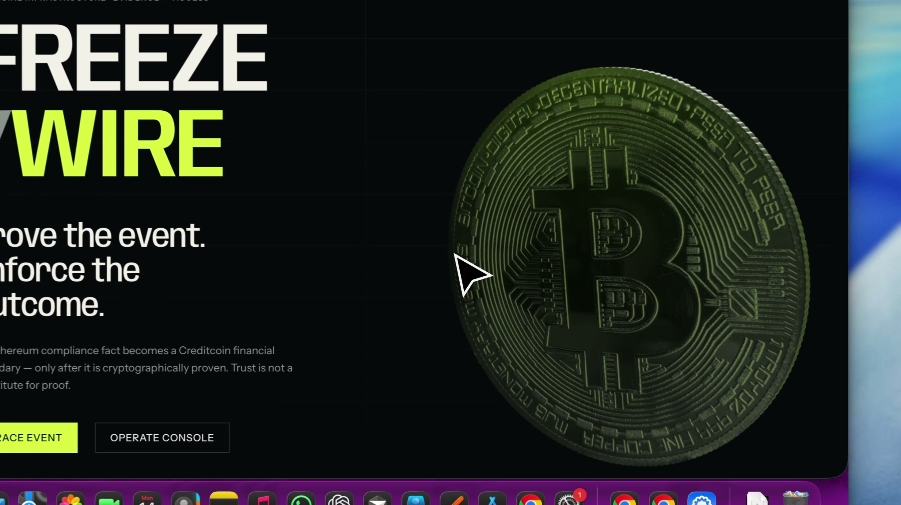

# FreezeWire

### *Prove the event. Enforce the outcome.*

FreezeWire turns Circle USDC compliance events (`Blacklisted` / `UnBlacklisted`) on Ethereum into cryptographically proven eligibility state on Creditcoin CC3. There is no oracle setter and no `setStatus`: eligibility moves only when Attestcoin Merkle inclusion and continuity proofs pass Creditcoin’s BlockProver precompile (`0x0FD2`) plus FreezeWire consumer checks.

[](https://frontend-bice-pi-49.vercel.app)
[](https://freezewire-backend.onrender.com/v1/health)
[](https://github.com/CodewithJha/freeze-wire)
[](https://creditcoin-testnet.blockscout.com)
[](LICENSE)
[](contracts/test)
[](backend/test)
[](frontend/src)

**Live:** [Demo UI](https://frontend-bice-pi-49.vercel.app) · [Worker health](https://freezewire-backend.onrender.com/v1/health) · [Repo](https://github.com/CodewithJha/freeze-wire)

---

## Demo video

[~2 min] Circle USDC blacklist fact → Attestcoin proof → Creditcoin `RESTRICTED` enforcement (no oracle setter).

[](docs/media/freeze-wire-demo.mp4)

**Watch:** [`docs/media/freeze-wire-demo.mp4`](docs/media/freeze-wire-demo.mp4) · [open raw on GitHub](https://github.com/CodewithJha/freeze-wire/raw/master/docs/media/freeze-wire-demo.mp4)

<video src="docs/media/freeze-wire-demo.mp4" controls poster="docs/media/freeze-wire-demo-poster.jpg" width="720" title="FreezeWire demo">
</video>

---

## What is FreezeWire?

Creditcoin contracts cannot read Ethereum logs natively. FreezeWire bridges **address-level** Circle USDC blacklist facts into CTC credit and escrow by verifying Attestcoin proofs on-chain, then gating a demo credit line:

| Status | Draw / protected transfer / new escrow | Repay / unused withdraw / deposit |
|:---|:---|:---|
| `ELIGIBLE` (default) | Allowed | Allowed |
| `RESTRICTED` | Reverts `Restricted()` | Allowed (solvency exits preserved) |

FreezeWire freezes a **counterparty**, not an instrument. It is not CEL (Collateral Eligibility Ledger): same Attestcoin spine, different gate object.

---

## Why it exists

The usual pattern is an oracle or keeper that calls:

```solidity
function setRestricted(address borrower, bool isRestricted) external onlyOwner;
```

That privileges a key: compromise freezes competitors or clears bad actors; downtime leaves markets blind; LPs trust an off-chain narrative.

**FreezeWire has no `setStatus` / `setRestricted`.** The worker is untrusted transport and gas. Anyone may call `submitProof(calldata)`; state changes only if `0x0FD2` and consumer checks succeed.

| Approach | Who decides Restricted? |
|:---|:---|
| Admin setter / API indexer | Privileged key or backend narrative |
| FreezeWire | Attestcoin-proven Circle USDC event → address eligibility |

---

## How it works

1. **Source event** — Circle FiatToken on Ethereum emits `Blacklisted` / `UnBlacklisted` (receipt `status == 1`).
2. **Proof build** — Attestcoin Proof Builder returns Merkle inclusion + header continuity for `chainKey` (Ethereum mainnet = `3` on CC3 testnet).
3. **Permissionless submit** — Worker or any caller relays `submitProof` on Creditcoin CC3 (`chainId` `102031`).
4. **`0x0FD2`** — BlockProver verifies inclusion + continuity against attested headers.
5. **Consumer checks** — Receipt status, immutable USDC emitter, event topics, account from `topic[1]`, chainKey, height window, Merkle-derived `txIndex`.
6. **Ledger** — Replay key `(chainKey, height, txIndex)` burned; monotonic ordering applied; `statusOf[account]` updated.
7. **Enforcement** — `GatedCreditLine` reads `statusOf` each call; extractive paths blocked when `RESTRICTED`.

```text
Ethereum USDC log  →  Attestcoin proof  →  submitProof  →  0x0FD2 + consumer checks  →  EligibilityLedger  →  GatedCreditLine
```

---

## Why Attestcoin matters

BlockProver (`0x0000000000000000000000000000000000000FD2`) proves the submitted bytes are attested. It does **not** prove receipt success, Circle emitter identity, event topic, or account binding — those are FreezeWire **consumer** checks.

**Removal test:** If Attestcoin / `0x0FD2` is removed, FreezeWire cannot move an address to `RESTRICTED`. There is no owner setter, eligibility database, or worker privilege that invents a blacklist. Consumer checks alone cannot create state without a verified inclusion + continuity path.

Deeper notes: [`docs/ATTESTCOIN_INTEGRATION.md`](docs/ATTESTCOIN_INTEGRATION.md) · [`docs/ATTESTCOIN_INTEGRATION_SUMMARY.md`](docs/ATTESTCOIN_INTEGRATION_SUMMARY.md)

---

## Architecture

```text
┌─ Ethereum mainnet ─┐     ┌─ Attestcoin ─┐     ┌─ Creditcoin CC3 (102031) ──────────────┐
│ Circle USDC        │     │ Merkle +     │     │ BlacklistVerifier → 0x0FD2 + consumers │
│ Blacklisted(...)   │────►│ continuity   │────►│ EligibilityLedger (replay / ordering)  │
│                    │     │ proof bundle │     │ GatedCreditLine (selective gating)     │
└────────────────────┘     └──────────────┘     └────────────────────────────────────────┘
         ▲                                              ▲
         │         Untrusted worker (discover / prove / relay) — not an authority
```

| Layer | Role |
|:---|:---|
| Attestcoin / `0x0FD2` | Inclusion + continuity truth |
| `BlacklistVerifier` | Decode + bind USDC events after precompile |
| `EligibilityLedger` | Replay, ordering, `statusOf` |
| `GatedCreditLine` | Financial consequence |
| Backend / UI | Discovery & transport only |

Full map: [`docs/SYSTEM_ARCHITECTURE.md`](docs/SYSTEM_ARCHITECTURE.md)

---

## Smart Contracts

Solidity `0.8.23` · Foundry · three production contracts (+ `MockUSD` demo ERC-20 on CC3):

| Contract | Responsibility |
|:---|:---|
| **`BlacklistVerifier`** | Calls `0x0FD2`; status / emitter / topics / account / `txIndex` |
| **`EligibilityLedger`** | Permissionless `submitProof`; replay + ordering; `statusOf` |
| **`GatedCreditLine`** | Deposit / draw / repay / withdraw / escrow gated by ledger |

Libraries: `EvmV1Decoder`, `TxIndex`, `EventSelectors`. Spec: [`docs/SMART_CONTRACT_SPECIFICATION.md`](docs/SMART_CONTRACT_SPECIFICATION.md)

---

## Security model

| Threat | Defense |
|:---|:---|
| Spoof token `Blacklisted` log | Constructor-immutable `expectedEmitter` (Circle USDC) |
| Failed / reverted source tx | Receipt `status == 1` required |
| Redirect blacklist A → B | Account from verified `topic[1]` |
| Forged `txIndex` | Recovered from Merkle `isLeft` path |
| Replay / re-order | `(chainKey, height, txIndex)` burn + monotonic position |
| Malicious / down worker | Invalid proofs revert; anyone can submit |
| Trap funds on restrict | Repay + unused withdraw remain open |

There is **no** `setStatus`. Owner can tune operational window / chainKey, not Circle identity on a given deploy.

Docs: [`docs/SECURITY_MODEL.md`](docs/SECURITY_MODEL.md) · [`docs/THREAT_MODEL.md`](docs/THREAT_MODEL.md) · [`docs/SECURITY_EVIDENCE.md`](docs/SECURITY_EVIDENCE.md)

---

## Live deployment

Public demo stack (Creditcoin **CC3 testnet**, not mainnet production):

| Surface | URL |
|:---|:---|
| Frontend | https://frontend-bice-pi-49.vercel.app |
| Backend | https://freezewire-backend.onrender.com |
| Health | https://freezewire-backend.onrender.com/v1/health |
| Explorer | https://creditcoin-testnet.blockscout.com |
| RPC | https://rpc.cc3-testnet.creditcoin.network |

Localhost and tunnels are for development only — not the public deployment.

---

## Live contracts

Verified against [`deployments/demo-evidence-public.json`](deployments/demo-evidence-public.json) (and local `deployments/cc3-testnet.json` when present):

| Field | Value |
|:---|:---|
| Network | Creditcoin CC3 Testnet · `chainId` **102031** |
| Attestcoin `chainKey` (ETH mainnet) | **3** |
| BlockProver | `0x0000000000000000000000000000000000000FD2` |
| Deploy block | `5479278` |
| Proof window | `minHeight=0`, `maxHeight=0` (unbounded — disclosed testnet default; not a production freshness policy) |
| Circle USDC (Ethereum source) | `0xA0b86991c6218b36c1d19D4a2e9Eb0cE3606eB48` |
| MockUSD (CC3 demo liquidity — **not** Circle USDC) | `0x6943EB32EAb562791f095E91ee288627ADDdC5B3` |
| BlacklistVerifier | `0x6bf238291Bb8262918A1989831856DC6BC47D869` |
| EligibilityLedger | `0xde64d5037cA820D4aDFa703C4FaF5451be840C9d` |
| GatedCreditLine | `0xB04fFca20e0a992474E6AD501A061973dC9Ed340` |

---

## Live proof

Pinned real Circle USDC blacklist on Ethereum:

| Item | Value |
|:---|:---|
| Source tx | [`0xc9edfdbb…f787`](https://etherscan.io/tx/0xc9edfdbb67b48f26822d8769f63cb890599d98dec539f7f76b92edcc8a2ff787) |
| Height / `txIndex` | `25705174` / `18` |
| Restricted account | `0xe05F529f5284D75624eBa386CB716928c3b54A2A` |
| CC3 `submitProof` | [`0x07e30451…fc45`](https://creditcoin-testnet.blockscout.com/tx/0x07e30451fb38776aa972603e94aeb8f779f182a5047a371195df2d598a4dfc45) |
| Evidence `statusOf` | `RESTRICTED` |

### Two-account honesty

`0xe05F…` is **already `RESTRICTED`** after a prior permissionless `submitProof`. Do **not** claim a live ELIGIBLE→RESTRICTED flip on that address.

| Role | Address | Show |
|:---|:---|:---|
| Eligible actor | `0x6b07454d70896cad371982A57037933e24F4cD52` | Deposit / draw / repay / withdraw succeed |
| Restricted counterparty | `0xe05F529f5284D75624eBa386CB716928c3b54A2A` | Draw reverts; repay / unused withdraw OK |

*The backend never told Creditcoin the address was blacklisted. The Attestcoin proof did.*

Walkthrough: [`docs/DEMO_SPECIFICATION.md`](docs/DEMO_SPECIFICATION.md) · [`docs/DEMO_RUNBOOK.md`](docs/DEMO_RUNBOOK.md)

---

## Try it

1. Open the [live demo](https://frontend-bice-pi-49.vercel.app).
2. Inspect the [Ethereum source tx](https://etherscan.io/tx/0xc9edfdbb67b48f26822d8769f63cb890599d98dec539f7f76b92edcc8a2ff787).
3. Confirm ledger Restricted + draw revert evidence via [Blockscout `submitProof`](https://creditcoin-testnet.blockscout.com/tx/0x07e30451fb38776aa972603e94aeb8f779f182a5047a371195df2d598a4dfc45) and public evidence JSON.
4. Optionally hit worker `GET /v1/evidence/demo` and `GET /v1/prove/{tx}` on the Render backend.

---

## Local development

**Prerequisites:** Node.js ≥ 20, Foundry (`forge` / `cast` / `anvil`), Git.

```bash
git clone https://github.com/CodewithJha/freeze-wire.git
cd freeze-wire
cp .env.example .env
cp frontend/.env.example frontend/.env.local
```

### Contracts

```bash
forge fmt --check
forge build
forge test
# → 95 passed, 0 failed, 1 skipped (96 total; skip is optional live Attestcoin)
```

### Backend

```bash
cd backend
npm ci
npm test        # 46 passed
npm run build
npm start       # http://127.0.0.1:8000 (WORKER_PORT)
# optional: LIVE_ATTESTCOIN=1 npm test
```

### Frontend

```bash
cd frontend
npm ci
npm test        # 17 Vitest
npm run dev     # http://localhost:5173
npm run build
```

---

## Repository structure

```text
freeze-wire/
├── contracts/     # Foundry: Verifier, Ledger, GatedCreditLine, libs, tests
├── backend/       # Stateless worker: /v1/health, discover, prove, relay
├── frontend/      # React 19 + Vite demo UI
├── config/        # Network profiles
├── deployments/   # Public evidence + registries (*-public.json committed)
├── docs/          # Specs, security, Attestcoin, demos
├── scripts/       # Deploy / sync helpers
└── foundry.toml
```

---

## Use cases

Potential (not current customers):

- Credit / lending markets that must inherit Circle address sanctions without an oracle key
- Escrow and protected transfer flows that freeze extractive actions while preserving repay/exit
- Compliance-aware credit lines on Creditcoin that treat Attestcoin as the trust anchor

---

## Current limitations

- Deployed on **CC3 testnet** only; not a mainnet credit-bureau or production security claim
- **MockUSD** is demo liquidity on CC3; Circle USDC is the Ethereum **source fact** only
- Proof height window is **unbounded `(0,0)`** on the live testnet deploy (disclosed)
- Default unseen address is `ELIGIBLE` (fail-open) until a proven event binds it
- Worker availability affects convenience, not on-chain truth (permissionless submit remains)

---

## Documentation

| Doc | Topic |
|:---|:---|
| [`docs/SYSTEM_ARCHITECTURE.md`](docs/SYSTEM_ARCHITECTURE.md) | Component boundaries |
| [`docs/SMART_CONTRACT_SPECIFICATION.md`](docs/SMART_CONTRACT_SPECIFICATION.md) | Contracts & interfaces |
| [`docs/SECURITY_MODEL.md`](docs/SECURITY_MODEL.md) | Invariants |
| [`docs/THREAT_MODEL.md`](docs/THREAT_MODEL.md) | Threats |
| [`docs/SECURITY_EVIDENCE.md`](docs/SECURITY_EVIDENCE.md) | Evidence map |
| [`docs/ATTESTCOIN_INTEGRATION.md`](docs/ATTESTCOIN_INTEGRATION.md) | Precompile & proofs |
| [`docs/ATTESTCOIN_INTEGRATION_SUMMARY.md`](docs/ATTESTCOIN_INTEGRATION_SUMMARY.md) | Short Attestcoin briefing |
| [`docs/ATTESTCOIN_EVIDENCE.md`](docs/ATTESTCOIN_EVIDENCE.md) | Live Attestcoin evidence |
| [`docs/API_SPECIFICATION.md`](docs/API_SPECIFICATION.md) | Worker HTTP API |
| [`docs/DEMO_SPECIFICATION.md`](docs/DEMO_SPECIFICATION.md) | Demo script |
| [`docs/DEMO_RUNBOOK.md`](docs/DEMO_RUNBOOK.md) | Operator runbook |
| [`docs/COMPETITIVE_POSITIONING.md`](docs/COMPETITIVE_POSITIONING.md) | Oracle / CEL differentiation |
| [`docs/REQUIREMENTS.md`](docs/REQUIREMENTS.md) | Requirement IDs |
| [`docs/TEST_STRATEGY.md`](docs/TEST_STRATEGY.md) | Test mapping |
| [`docs/adr/`](docs/adr/) | Architecture decision records |
| [`CONTRIBUTING.md`](CONTRIBUTING.md) | Contribution process |

---

## Contributing

See [`CONTRIBUTING.md`](CONTRIBUTING.md). Specs under `docs/` are the source of truth; map changes to requirement IDs and ADRs when architectural. Do not commit secrets or hard-code network endpoints — use `config/` and `.env.example`.

---

## Attribution

- **3D asset:** Bitcoin model (`frontend/public/models/bitcoin.glb`) by **Taohid Animation**, [CC BY 4.0](https://creativecommons.org/licenses/by/4.0/). See [`frontend/public/models/README.md`](frontend/public/models/README.md). Remapped materials and lighting are FreezeWire-authored.
- **Protocol:** Creditcoin CC3 & Attestcoin BlockProver — [Gluwa](https://gluwa.com).
- **Compliance source:** Circle Internet Financial, LLC (USDC FiatToken event signatures).

---

## License

MIT — see [`LICENSE`](LICENSE).
