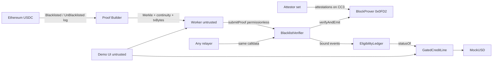
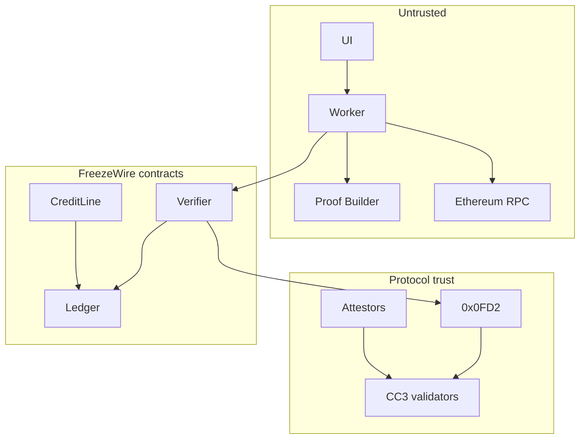

# System architecture

```text
Ethereum
   │  Source event: USDC Blacklisted / UnBlacklisted
   ↓
Attestcoin
   │  Merkle inclusion + continuity (attestors + Proof Builder liveness)
   ↓
FreezeWire verification layer
   │  0x0FD2 + consumer checks
   ↓
Compliance state
   │  address → ELIGIBLE | RESTRICTED
   ↓
Creditcoin / CTC financial layer
   │  GatedCreditLine + MockUSD
   ↓
Protected financial operations
      draw / transfer / escrow release  vs  repay / unused withdraw
```



Trust flows **down** from attestors + Creditcoin validators. The worker and UI are outside the trust boundary.

---

## Components

### 1. Ethereum USDC (source)

| | |
|---|---|
| Responsibility | Canonical issuer compliance events |
| Inputs | Circle blacklister `blacklist` / `unBlacklist` |
| Outputs | Receipt logs `Blacklisted` / `UnBlacklisted` |
| Dependencies | Ethereum consensus |
| Trust | **Trusted as source of meaning.** If Circle’s contract lies, FreezeWire inherits the lie. |
| Failure | Reorgs / failed txs — mitigated by attestation finality + `receiptStatus == 1` |
| Boundary | Source chain. FreezeWire does not write here. |

### 2. Attestors + ChainInfo (`0x0FD3`)

| | |
|---|---|
| Responsibility | Consensus on source-chain block commitments stored on Creditcoin |
| Inputs | Source headers |
| Outputs | On-chain attestations / checkpoints |
| Trust | **Trusted protocol set.** FreezeWire does not replace it. |
| Failure | Lag (minutes). Product gates **new** credit, not same-block CTC txs. |
| Boundary | Creditcoin runtime. |

### 3. Proof Builder (hosted)

| | |
|---|---|
| Responsibility | **Liveness:** construct Merkle + continuity + `txBytes` |
| Inputs | `chainKey`, tx hash or `(height, txIndex)` |
| Outputs | `SingleContinuityResponse` |
| Trust | **Untrusted for truth.** A forged bundle fails `0x0FD2`. |
| Failure | 422 BlockNotReady; degraded health; 501 hash lookup. Worker retries; does not invent proofs. |
| Boundary | HTTPS. Optional API key if required later. |

### 4. BlockProver precompile (`0x0FD2`)

| | |
|---|---|
| Responsibility | Native verification of inclusion + continuity |
| Inputs | `chainKey`, `height`, `encodedTransaction`, `MerkleProof`, `ContinuityProof` |
| Outputs | `bool`; `verifyAndEmit` emits `TransactionVerified` |
| Trust | **Trusted runtime.** Does **not** check receipt status or logs. |
| Failure | Returns false / reverts — FreezeWire aborts write |
| Boundary | Creditcoin precompile. |

### 5. BlacklistVerifier (FreezeWire ASC adapter)

| | |
|---|---|
| Responsibility | Call precompile; decode bytes; consumer checks; return bound events. **No eligibility storage.** |
| Inputs | Proof bundle from caller |
| Outputs | Validated `{account, kind, position}` list |
| Dependencies | `0x0FD2`, EvmV1Decoder lib, constructor emitter, owner-config chainKey/window |
| Trust | Code. Owner can rotate chainKey/window, not emitter or eligibility. |
| Failure | Custom errors: `ProofRejected`, `WrongChainKey`, `OutsideWindow`, `SourceTxFailed`, `MalformedTx`. Empty canonical match: ledger marks replay, emits `ProcessedWithoutFact`, does **not** revert (ADR-0017). |
| Boundary | Creditcoin EVM. |

### 6. EligibilityLedger

| | |
|---|---|
| Responsibility | Only writer of `address → Status`. Replay map. Ordering. |
| Inputs | Bound events from Verifier via `submitProof` |
| Outputs | `statusOf(address)`, events `Restricted` / `Restored` |
| Trust | Proof is authority. `submitProof` permissionless. |
| Failure | Replay / stale restore — revert or skip, no eligibility write; no-match burns the replay key without reverting (ADR-0017) |
| Boundary | Creditcoin EVM. |

### 7. GatedCreditLine

| | |
|---|---|
| Responsibility | Deposit, draw, repay, withdraw, minimal escrow; read ledger |
| Inputs | User txs, `statusOf` |
| Outputs | Token movements, reverts `Restricted` |
| Dependencies | Ledger, MockUSD |
| Trust | Does **not** talk to Attestcoin. Must not cache stale status across txs (read ledger each call). |
| Failure | Token/ERC20 errors; Restricted |
| Boundary | Creditcoin EVM. |

### 8. MockUSD

| | |
|---|---|
| Responsibility | Demo unit of account |
| Trust | **Not USDC.** No reserves claim. |
| Boundary | Creditcoin EVM. |

### 9. Readability worker (backend)

| | |
|---|---|
| Responsibility | Discover logs, fetch proofs, relay, expose demo HTTP |
| Inputs | Ethereum RPC, Proof Builder, CC3 RPC |
| Outputs | Relayed txs, JSON for UI |
| Trust | **Untrusted.** SEC-001. |
| Failure | Timeouts, 422, RPC lies — stall, never authorize |
| Boundary | Off-chain. |

### 10. Demo frontend

| | |
|---|---|
| Responsibility | Presentation |
| Trust | **Untrusted.** SEC-011. |
| Failure | Wallet reject — show error |
| Boundary | Browser. |

### 11. Ethereum / CC3 RPCs

| | |
|---|---|
| Responsibility | Read/write transport |
| Trust | Worker must not treat RPC as authority for eligibility. Chain state is authority. |
| Failure | Timeout, fork views — retry, compare chain id |

---

## Security boundaries



Crossing untrusted → app requires a proof that protocol verifies. No other crossing writes the ledger.

---

## Failure modes (system)

| Failure | User-visible | State |
|---|---|---|
| Proof Builder down | Worker 503 / retry | Unchanged |
| Height not attested | 422 BlockNotReady | Unchanged |
| Precompile false | `ProofRejected` | Unchanged |
| Wrong log | `ProcessedWithoutFact` | Eligibility unchanged; replay key burned (no revert) |
| Relayer out of gas | Tx fail | Unchanged |
| Attestation lag | Delay until attested | Unchanged; new draws still use last proven state |

---

## Why three contracts

Official Attestcoin docs allow combined ASC+logic or separated pattern. FreezeWire uses **separated** (ADR-0003): verification complexity must not share storage with credit accounting; financial ops must not call `0x0FD2`.

---

## What is not in the diagram as authority

Credal, our backend, the demo UI, and any “blacklist API” are non-authoritative. Discovery is best-effort.
